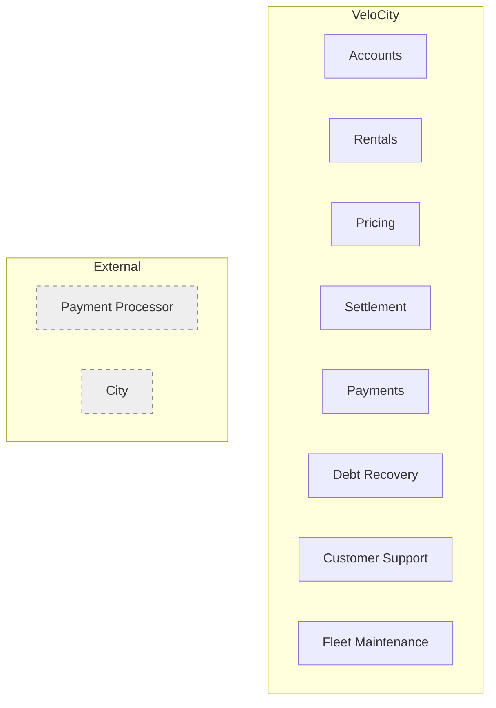
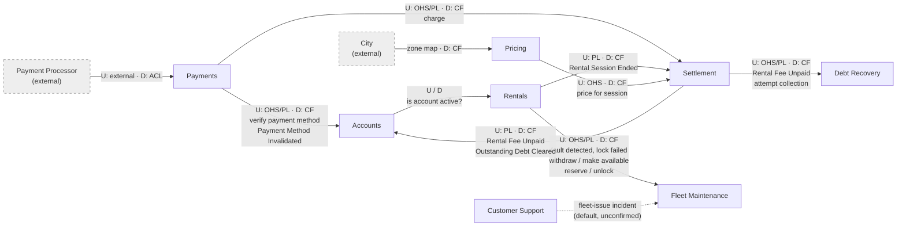
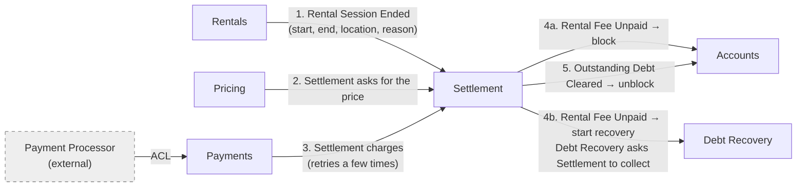

# VeloCity — Reference Context Map

> This is the reference solution for the VeloCity context mapping exercise. Group should be able to achieve a similar result based on collaboration with the domain expert.

The solution below is one well-argued answer, not the only correct one. See **Accepted alternatives** before judging a group's result.

---

## Bounded Contexts

| Context | Owns | Key language |
|---|---|---|
| **Accounts** | Onboarding, account activation, account blocks and unblocks | user, registration, activated, blocked |
| **Rentals** | Bike availability (available / withdrawn), reserve & unlock for any authorised client, rental sessions, station returns & locking, max-rental-time end, withdrawing a bike on a fault it detects | reservation, unlock, rental session, available, withdrawn |
| **Pricing** | Pure calculation of the total fee — tiered hourly fees, penalty, drop zone / unauthorized zone fees, tariff valid at session start | free period, hourly fee, penalty, drop zone fee, total fee |
| **Settlement** | Charging each finished ride, retries, rider's balance and outstanding debt | charge, settled, outstanding debt |
| **Payments** | Payment method verification and charging; shields VeloCity from the external processor | payment method, pre-authorization, verified, charge |
| **Debt Recovery** | Active pursuit of outstanding debt — reminders, payment plans, pause / resume | recovery process, paused, resumed, exhausted, payment plan |
| **Customer Support** | Incidents: reported → type detected → assigned → accepted / rejected → resolved | incident, accept, reject, escalate, reopen, resolve |
| **Fleet Maintenance** | Broken bikes, maintenance, deciding when a bike returns to circulation | broken, maintenance, fixed, back in circulation |

**External parties:** the **Payment Processor** and the **City** (zone map used by Pricing).

### Overview

---

## Context Map

Every arrow points from **upstream (U)** to **downstream (D)**. Labels give the pattern and what flows across the boundary. Data may flow in both directions (events one way, commands the other) — the arrow shows **whose language the integration uses**.

**Legend**

| Abbreviation | Meaning |
|---|---|
| **U / D** | Upstream / Downstream |
| **OHS** | Open Host Service — upstream offers a protocol for any number of clients |
| **PL** | Published Language — the shared, documented format of that protocol (events, commands) |
| **CF** | Conformist — downstream adopts the upstream model as-is |
| **ACL** | Anticorruption Layer — downstream translates the upstream model into its own |
| dashed arrow | Default assumption, not confirmed |

### Zoom: from a finished ride to money

The ride-to-money flow has the most traffic in both directions, yet no cycles. Settlement *calls* Pricing and Payments, and Debt Recovery *calls* Settlement — the caller is always downstream.

---

## Key Design Decisions

- **No Station context.** A station is a thin client of Rentals; locking, fault detection at return and locking failures live in Rentals.
- **No reroute.** Every return ends the ride; the location only decides the fee (drop zone fee vs. unauthorized zone return fee). The client-reported location is trusted.
- **Rentals owns availability in generic language** — *available* / *withdrawn*, never *broken*. Fleet Maintenance (and potentially other clients, e.g. a future marketing context re-branding bikes) decides what happens to a bike and calls Rentals.
- **Rentals withdraws a bike itself when it detects a fault** (locking failure, fault at station return). Only clients decide when it becomes available again. A broken bike is never offered to riders.
- **Reserve / unlock is a generic Rentals capability.** Only a rider's unlock starts a rental session; Fleet Maintenance reacts to a technician's unlock with *Maintenance Started*.
- **A locking failure ends the session immediately** with an explanation; the rider is not charged extra and the bike is withdrawn.
- **Max rental time is detected by Rentals**, which ends the session automatically; Pricing adds the penalty.
- **Pricing is a pure calculator**, called by Settlement, using the tariff valid at session start.
- **Settlement is the only context that moves money** (via Payments) and owns the rider's balance. Debt Recovery asks Settlement to collect.
- **Account blocks have exactly two reasons, each from one source:** invalid card (Payments) and outstanding debt (Settlement). Settlement drives both block and unblock for debt.
- **No cycles.** If two contexts have arrows in both directions, ask whose language the integration uses — if both, it is either a Partnership or a misplaced boundary.

---

## Accepted Alternatives for the Debrief

- A single **Returns** context (station + zone returns) instead of returns inside Rentals.
- **"Billing"** as the name for Pricing — it is the domain expert's word.
- **Pricing reacting** to *Rental Session Ended* instead of being called by Settlement (orchestration direction is a design choice, not a heuristic outcome).
- **Fleet Maintenance upstream of Rentals** (Rentals reports faults via Maintenance's OHS) — as long as there is no cycle.
- The **Payment Processor drawn as external** with ACLs directly in Accounts and Settlement, without a Payments context.
- **Debt Recovery → Accounts** for unblocking (discuss: *whose fact is "the debt is paid"?*).
- **Settlement and Debt Recovery merged**, if the group can't find a language difference — point them to *reminders, payment plans, pause* vs. *charge, retry, settled*.

---

## Deferred / Open

- **Billing disputes → pausing Debt Recovery** (from Customer Support) — not modeled yet.
- **Fleet-issue incidents** routed Customer Support → Fleet Maintenance → Rentals (withdraw) — default, unconfirmed.
- **Faults signaled by the bike itself** received by Rentals (it owns locks and stations) — default, unconfirmed.